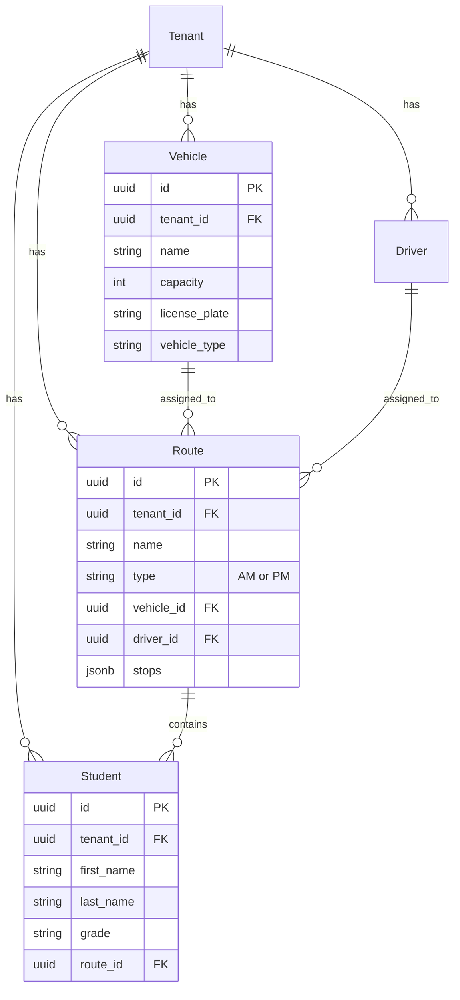

# Routes and Vehicles Implementation - Complete

## Summary

Successfully implemented a complete Routes and Vehicles management system with:
- ✅ Database tables with RLS policies and audit triggers
- ✅ Prisma schema updates
- ✅ Server actions for CRUD operations
- ✅ API endpoints
- ✅ UI components (tables, modals, forms)
- ✅ Dashboard pages
- ✅ Capacity logic and indicators
- ✅ Full tenant isolation with audit logging

## Database Migrations to Run

You need to run the following SQL migrations in your **Supabase SQL Editor** in this order:

### 1. Create Vehicles Table
File: `prisma/migrations/create-vehicles-table.sql`
- Creates `vehicles` table with all fields
- Enables RLS with tenant isolation policy
- Creates tenant isolation trigger
- Creates audit trigger
- Creates `app.v_vehicles` view

### 2. Create Routes Table
File: `prisma/migrations/create-routes-table.sql`
- Creates `routes` table with all fields
- Enables RLS with tenant isolation policy
- Creates tenant isolation trigger
- Creates audit trigger
- Creates `app.v_routes` view

### 3. Update Students Table
File: `prisma/migrations/add-route-id-to-students.sql`
- Adds `route_id` foreign key column to students
- Creates index for performance
- Updates `app.v_students` view to include route_id

## After Running Migrations

1. **Generate Prisma Client:**
   ```bash
   npx prisma generate
   ```

2. **Verify Database:**
   - Check that all tables exist: `vehicles`, `routes`
   - Check that `students` table has `route_id` column
   - Check that all views exist: `app.v_vehicles`, `app.v_routes`, `app.v_students`
   - Check that triggers are attached: `audit_vehicles`, `audit_routes`, etc.

3. **Test the Application:**
   - Navigate to `/dashboard/vehicles` to manage vehicles
   - Navigate to `/dashboard/routes` to manage routes
   - Create a vehicle, then assign it to a route
   - Create students and assign them to routes
   - Check capacity indicators on routes
   - Verify audit logs are being created

## Features Implemented

### Database Layer
- **vehicles** table with capacity, license plate, vehicle type
- **routes** table with AM/PM type, vehicle FK, driver FK, JSONB stops
- **students** table updated with route_id FK
- RLS policies on all tables for tenant isolation
- Database triggers for tenant validation
- Audit triggers for all changes
- Security barrier views for SELECT operations

### Server Actions (lib/actions.ts)
- `getVehicles()`, `createVehicle()`, `updateVehicle()`, `deleteVehicle()`, `getVehicleById()`
- `getRoutes()`, `createRoute()`, `updateRoute()`, `deleteRoute()`, `getRouteById()`
- `assignDriverToRoute()`, `assignVehicleToRoute()`, `assignStudentToRoute()`
- `getRouteCapacity()` - calculates student count vs vehicle capacity
- `getRoutesByType(type)` - filter by AM/PM

### API Endpoints
- `POST /api/vehicles` - Create vehicle
- `POST /api/routes` - Create route

### UI Components
- `VehiclesTable` - Display vehicles with capacity info
- `RoutesTable` - Display routes with type, vehicle, driver, capacity
- `RouteCapacityIndicator` - Visual capacity status with progress bar
- `AddVehicleButton` / `EditVehicleModal` - Vehicle CRUD modals
- `AddRouteButton` / `EditRouteModal` - Route CRUD modals with JSON stops editor

### Dashboard Pages
- `/dashboard/vehicles` - Vehicles management page
- `/dashboard/routes` - Routes management page
- Both with loading states and Suspense boundaries

## Capacity Logic

The `getRouteCapacity()` function:
1. Queries the route and its assigned vehicle
2. Counts students assigned to the route
3. Returns:
   - `assigned`: Number of students on route
   - `capacity`: Vehicle capacity
   - `available`: Remaining seats
   - `isFull`: Boolean if at/over capacity

The capacity indicator shows:
- Green: Route has capacity available
- Yellow: Route is 80%+ full
- Red: Route is at/over capacity
- Progress bar visualizing utilization

## Security

All operations enforce tenant isolation through:
1. **Database-level RLS policies** - Filter by tenant_id using session variables
2. **Database triggers** - Validate tenant_id on INSERT/UPDATE/DELETE
3. **Security barrier views** - Automatic tenant filtering on SELECT
4. **Audit triggers** - Log all changes with tenant_id, user_id, IP

## Data Model



## Next Steps

1. Run the SQL migrations in Supabase
2. Generate Prisma client
3. Test all CRUD operations
4. Verify audit logs are working
5. Test capacity logic and indicators
6. Add navigation links in the dashboard layout (optional)

## Files Created/Modified

### New Files (23)
- `prisma/migrations/create-vehicles-table.sql`
- `prisma/migrations/create-routes-table.sql`
- `prisma/migrations/add-route-id-to-students.sql`
- `app/api/vehicles/route.ts`
- `app/api/routes/route.ts`
- `app/dashboard/vehicles/page.tsx`
- `app/dashboard/vehicles/loading.tsx`
- `app/dashboard/vehicles/vehicles-page-client.tsx`
- `app/dashboard/routes/page.tsx`
- `app/dashboard/routes/loading.tsx`
- `app/dashboard/routes/routes-page-client.tsx`
- `components/VehiclesTable.tsx`
- `components/RoutesTable.tsx`
- `components/RouteCapacityIndicator.tsx`
- `components/AddVehicleButton.tsx`
- `components/EditVehicleModal.tsx`
- `components/AddRouteButton.tsx`
- `components/EditRouteModal.tsx`

### Modified Files (2)
- `prisma/schema.prisma` - Added Vehicle, Route models; updated Student, Tenant, Driver models
- `lib/actions.ts` - Added all vehicle and route CRUD functions, capacity logic

## Testing Checklist

- [ ] Run SQL migrations in order
- [ ] Generate Prisma client
- [ ] Create a vehicle (capacity: 20)
- [ ] Create a route (assign vehicle)
- [ ] Assign driver to route
- [ ] Create/assign students to route
- [ ] Verify capacity indicator shows correct count
- [ ] Test AM/PM route types
- [ ] Edit vehicle capacity, verify route capacity updates
- [ ] Delete operations (soft delete)
- [ ] Check audit_logs table for all operations
- [ ] Verify tenant isolation (create second tenant, verify data separation)

All implementation is complete and ready for testing!

